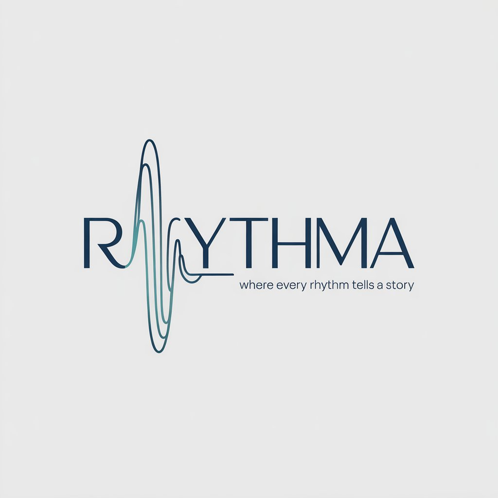
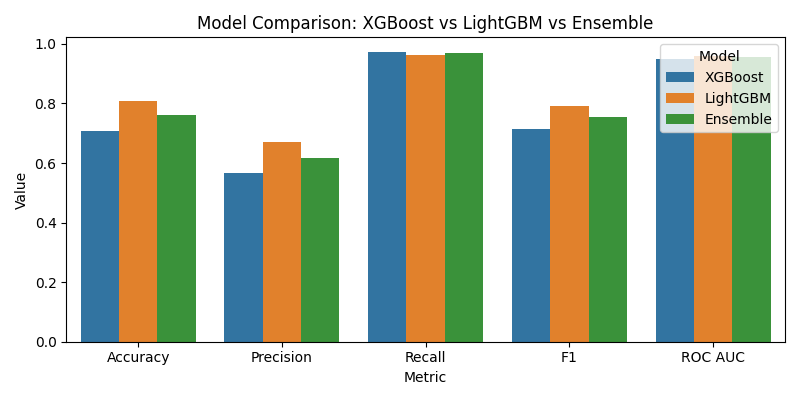

<p>
  
</p>

# Rhythma: Where Every Rhythm Tells A Story
## ~ Heart Failure Readmission Prediction
**Rhythma** is an ML based healthcare analytics platform that predicts hospital readmission risk for heart failure patients within 30 days of discharge.  
It leverages machine learning on clinical, demographic, and laboratory data to generate actionable insights for clinicians and healthcare administrators.

Live Site Link (Use PC/Laptop to view the website) : https://rhythma.streamlit.app/

---

## Table of Contents

- [Overview](#overview)
- [Key Features](#key-features)
- [Project Architecture](#project-architecture)
- [Installation](#installation)
- [Input Data Format](#input-data-format)
- [Modeling Pipeline](#modeling-pipeline)
- [Streamlit Web Application](#streamlit-web-application)
- [Example Workflow](#example-workflow)
- [Future Enhancements](#future-enhancements)
- [License](#license)

---

## Overview

Hospital readmissions for heart failure patients remain a critical issue, affecting patient outcomes and healthcare costs.  
Rhythma predicts the probability of readmission within 30 days using a LightGBM-based model and presents an interpretable, clinician-friendly dashboard.

The system can process both:
- **Processed CSV files**
- **Raw MIMIC-style datasets** (ZIP containing admissions, diagnoses, patients, and labevents data)

Rhythma automatically merges, cleans, encodes, dereives meaningful columns and analyzes data to deliver an end-to-end risk assessment workflow.

---

## Key Features

- **End-to-End Data Handling**  
  Upload a single ZIP containing hospital records; Rhythma automatically processes and merges them.

- **Machine Learning Prediction**  
  LightGBM model trained on patient admissions, demographic, and lab data.

- **Interactive Dashboard**  
  Visualizes readmission probability distributions, feature impact, and patient risk tiers.

- **Automated Report Generation**  
  Generates a downloadable PDF report summarizing results and insights.

- **Schema Enforcement & Auto-Training**  
  Automatically adapts uploaded datasets to the expected schema or retrains the model when required.

---

## Project Architecture

```
rhythma/
│
├── app/
│ └── streamlit_app.py # Main Streamlit application
│
├── models/
│ └── lightgbm_model.pkl # Trained model (auto-generated or preloaded)
│
├── dataset/
│ ├── raw/ # Optional raw hospital CSVs
│ └── processed/ # Processed merged data
│
├── scripts/
│ └── generate_synthetic_zip.py # Synthetic ZIP generator
│
├── requirements.txt
└── README.md
```
## Installation

### Prerequisites
- Python 3.10 or later  
- pip (latest version)

### Setup

```
git clone https://github.com/yourusername/rhythma.git
cd rhythma
python -m venv venv
venv\Scripts\activate   # On Windows
# or
source venv/bin/activate   # On macOS/Linux
pip install -r requirements.txt
```

### Run the Web Application
```
streamlit run app/streamlit_app.py
```
Access the app in your browser at http://localhost:8501

## Input Data Format

Rhythma accepts either of the following input types:

---

### 1. Processed CSV File

If you already have a cleaned dataset ready for prediction, ensure it contains the following **mandatory columns**:

| Column | Description |
|--------|--------------|
| **admission_type** | Type of hospital admission (e.g., EMERGENCY, ELECTIVE) |
| **admission_location** | Entry point or source of patient admission (e.g. EMERGENCY ROOM ADMIT) |
| **discharge_location** | Where the patient was discharged to (home, dead, etc.) |
| **insurance** | Type of insurance coverage |
| **hospital_expire_flag** | Indicator if the patient died during the hospital stay |
| **has_chartevents_data** | Boolean or binary flag indicating whether chart data exists |
| **gender** | Gender of the patient (M or F) |
| **age** | Patient age at admission, computed from `admittime - dob` |
| **lab_mean** | Mean value of all recorded lab test results |
| **lab_min** | Minimum lab test value during admission |
| **lab_max** | Maximum lab test value during admission |
| **lab_std** | Standard deviation of lab test values |
| **length_of_stay** | Number of days between admission and discharge computed from `admittime - dischtime`  |
| **severity** | Clinical severity score (categorical or numeric) |
| **lab_range** | Difference between `lab_max` and `lab_min` |
| **lab_ratio** | Ratio of `lab_mean / lab_std` |
| **stay_x_severity** | Product of `length_of_stay * severity` |
| **lab_stability** | Measure of stability: `1 / (1 + lab_std)` |
| **readmission_30days** | Target variable (1 = readmitted within 30 days, 0 = not) |

Each row represents one hospital admission record.

---

### 2. Raw MIMIC-style ZIP File

You can alternatively upload a ZIP archive containing the following **raw data files**:

- admissions_.csv

- diagnoses_icd_.csv

- patients_.csv

- labevents_.csv

Each file should follow the general MIMIC schema format.

Rhythma automatically:
1. Reads and merges these files on `subject_id` and `hadm_id`
2. Derives missing computed columns (`age`, `length_of_stay`, `lab_mean`, `lab_std`, etc.)
3. Enforces the final feature schema
4. Produces a cleaned dataset ready for model inference

---

### Example Folder Structure
```
readmission_data.zip
├── admissions_2025.csv
├── diagnoses_icd_2025.csv
├── patients_2025.csv
└── labevents_2025.csv
```
Upload this ZIP file directly to the Rhythma web application.  
The app will automatically process, merge, and validate the data before prediction.

## Modeling Pipeline

### 1. Data Cleaning & Integration

- Merge admissions, patients, diagnoses, and lab events.

- Derive age, length of stay, and lab statistics.

### 2. Feature Engineering

- Compute lab-based stability and ratio indicators.

- Encode categorical features using Label Encoding.

- Scale numerical features with StandardScaler.

### 3. Model Training (LightGBM)

- Uses stratified split (80-20).

- Optimized for recall and ROC-AUC.

- Automatically retrains if no pre-trained model is found.

### 4. Prediction & Analysis

- Outputs readmission probability and risk tier per patient.

- Visualizes correlations, severity trends, and key risk drivers.

### NOTE: 
During the development phase many models were tried and tested eg: LightGBM, Random Forset, XGBoost, Ensemble of XGBoost and LightGBM etc. A comparison was drawn between these models and LightGBM was picked based on its overall performance.

<p>
  
</p>

## Streamlit Web Application
### Sidebar

- Upload CSV or ZIP

- Set threshold for readmission risk classification

- Option to auto-train model if missing

### Dashboard Tabs

- Overview: Key distribution trends and severity-wise probability

- Risk Segmentation: Tiered risk levels and top at-risk patients

- Feature Impact: Correlation heatmaps and feature importance visualization

### Report

- Download full prediction results in CSV

- Generate a professional PDF summary with embedded charts

## Example Workflow

1. Launch the Streamlit app.

2. Upload readmission_demo.zip (or your hospital dataset).

3. Click Process & Predict.

4. Explore interactive dashboards:

- Probability distribution by severity and age

- Risk segmentation summary

- Feature importance analysis

5. Generate and download the PDF report for clinical review.

## Future Enhancements

1. Integration with MongoDB for data persistence

2. Role-based access and authentication

3. Support for additional models (CatBoost, XGBoost ensembles)

4. Model explainability with SHAP visualizations

5. Automated retraining pipeline using new hospital data

6. API endpoint for external hospital systems

## License 
This project is released under the MIT License.
You are free to use, modify, and distribute it with appropriate attribution.
